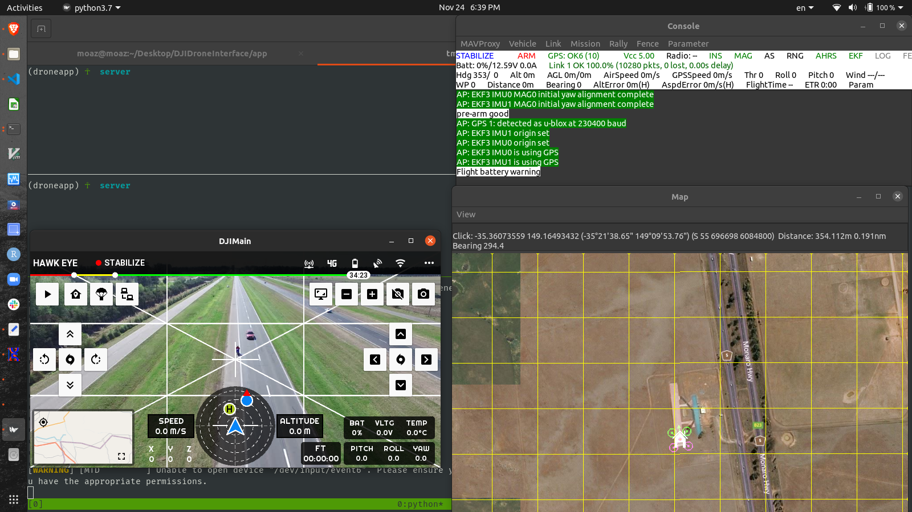
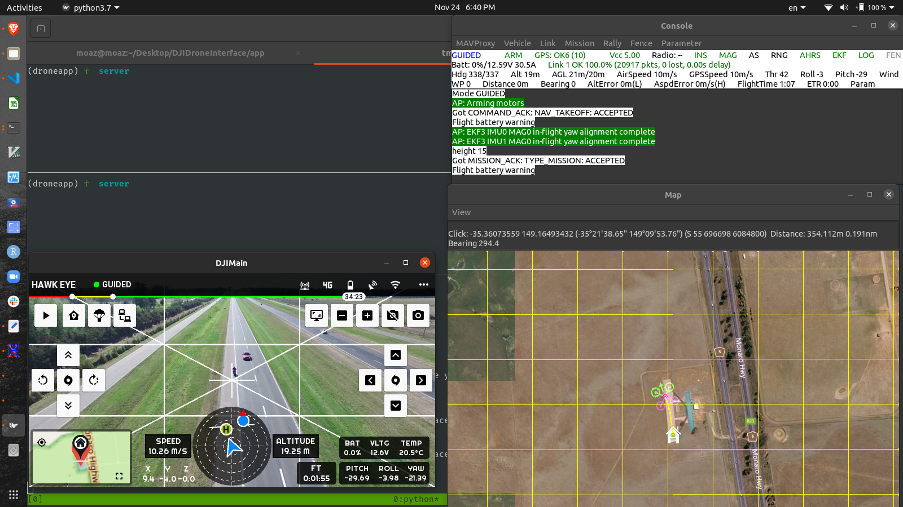
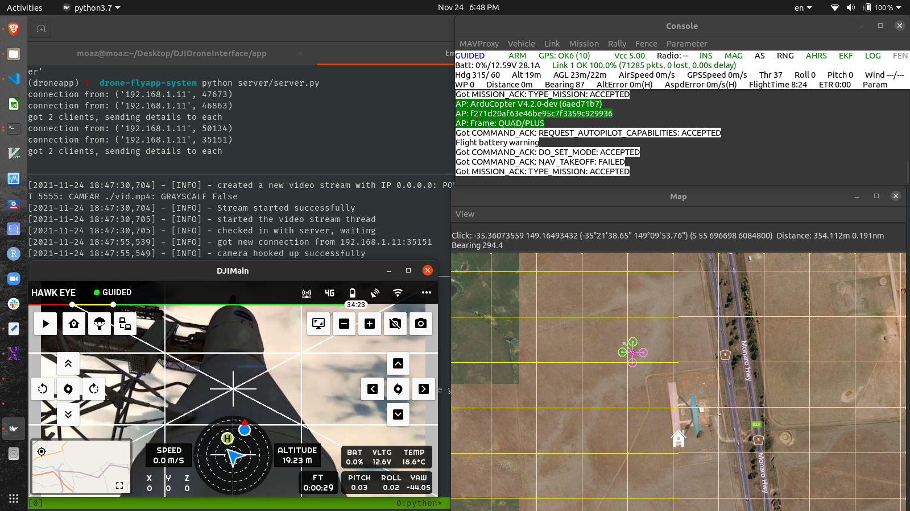
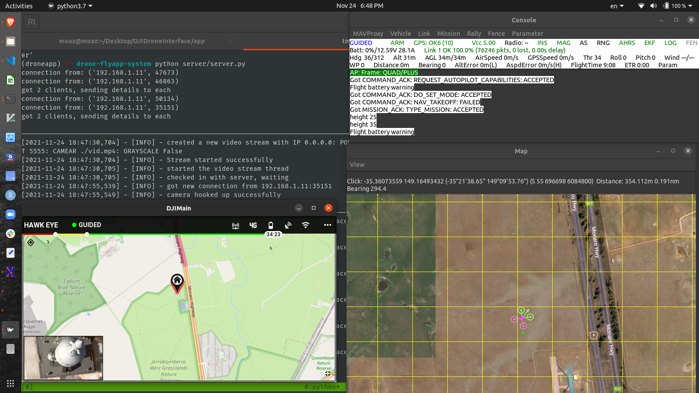

## Drone Controlling System.

drone controlling system is a package of:
- Android App build with `kivy`.
- Simulator from the `dronekit` library.
- `socket` server to transmite the camera feed from the drone.

### Setup Enironment
```sh
$ pip install -r requirements.txt
```

the app is quit complicated and requires has alot of interactions in order to start it properly.

in your base directory that contain the three folders that contains the code.

```sh
$ cd app/
$ python main.py --size=700x350 --dpi=300
```

and then in another termail tab or a window. change the directory to the `droneapp` dir.

Now in order to start your simulator to control a `drone` you need to setup the `SITL` simulator. which is quite complicated. and might be tricky in order to get it right.

after running the setup command you will install some library including `dronekit` and `pymavlink`. where the `dronekit` will setup the simulator and the `pymavlink` will be responsible for the communication between the `SITL` and the commands from out `kivy` app.

```sh
$ sim_vehicle.py -v ArduCopter --map --console --out 192.168.1.11:14551
```

above there I provided my **IP** address which is `192.168.1.11` now in all parts of my code i used that **IP** address so in your machine you need to change it to the one you will use. just by simple `find/replace` will change them for you.

the command above might take some time at the first time.

then start our tool that commands the drone with this command.

```sh
$ cd droneapp/
$ python run.py
```
but make sure to run this command after you started the drone and you get the message 

```sh
AP: EKF3 IMU0 origin set
AP: EKF3 IMU1 origin set
AP: EKF3 IMU1 is using GPS
AP: EKF3 IMU0 is using GPS
```

and after your you run the command above you should get 
```sh
Got COMMAND_ACK: REQUEST_AUTOPILOT_CAPABILITIES: ACCEPTED
```
if you did not get that message then you might have a problem in the setting up of the `SITL` simulator.

Now if you want just to stop and control the drone, that's enough and if you want to setup the drone camera feed and get live video feed from the drone to the screen of the `kivy` app.

Now open a new terminal window or a tab and split it up into two tabs.

in one tab start the `rendezvous server` which is just for communicating the `IP` and the `PORT` betweent the drone and client.

```sh
$ cd server/
$ python server.py
```

and in another tab start the client.
```sh
$ python client.py
```
Now after you started those you just press the `camera` button on the `kivy` app and it will start recieving the video frame into your app screen.

### Demo and Screenshots
- to start the drone and start the `takeoff` press on the first button at the left side.
- to start the drone communication between the drone and the app press on the fourth button button at the left side.
- to start the video feed recieving press on the last button at the right side `camera`






in the server dir you will find the `drone.ini` which has a some constant you can play with in order to achieve any change.