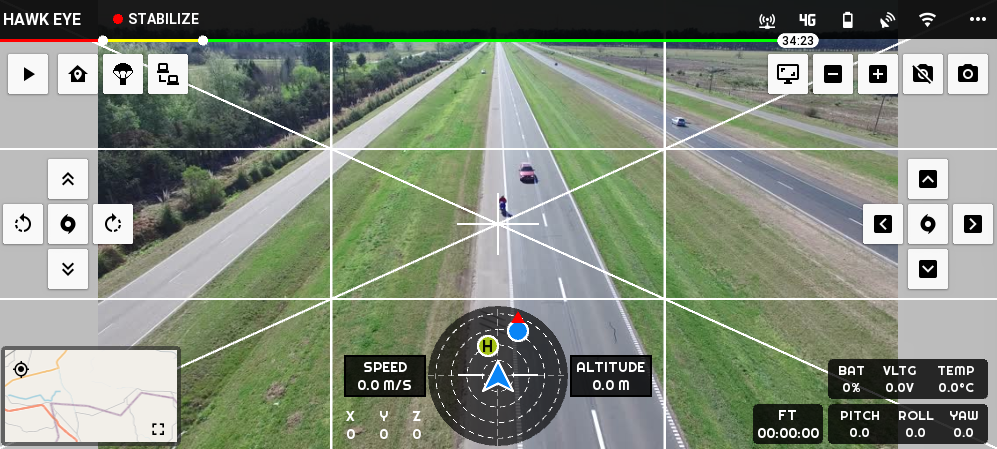
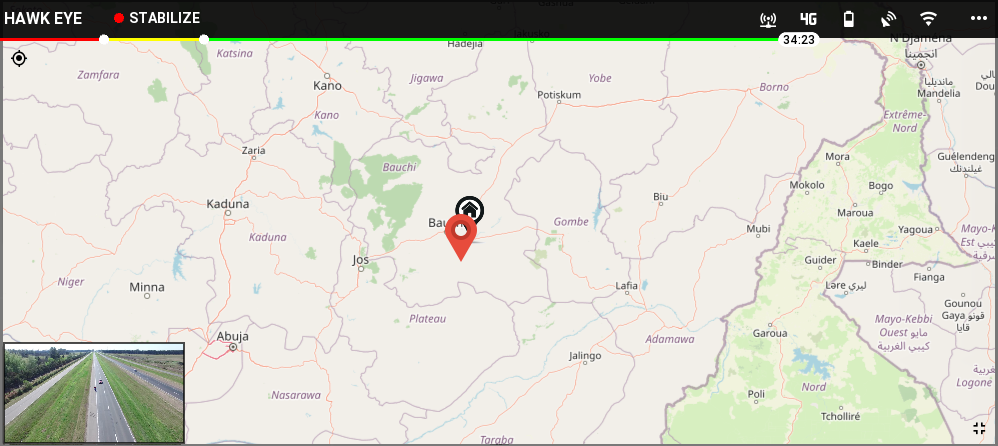

## DJI FlyApp Kivy Clone

the app is a clone of the DJI FlyApp build with `kivy` and `kivymd`. the full app build with a monitor and droneapp that use `dronekit` simulator and with a `socket` server that used for the video transmitting with a good latency and frame size as `640x360` and `FPS = 15`.

the `droneapp` is build with the `dronekit` tool and the `SITL` simulator with the `google` `protobuf` as a messaging tools that used to send and recieve commands from the `flyapp` and drone simulator.

### Demo

